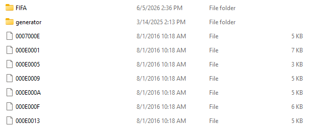
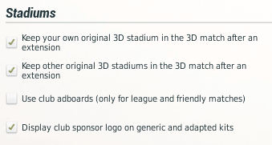
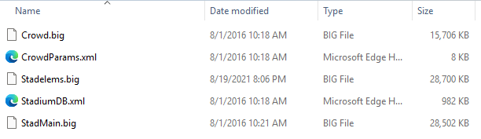
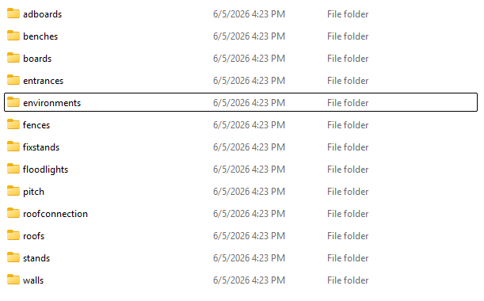
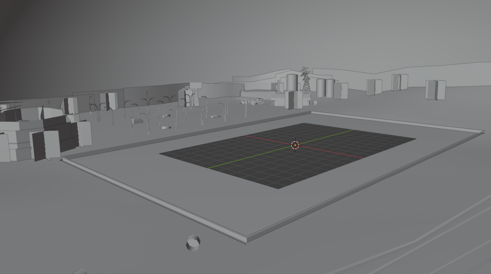
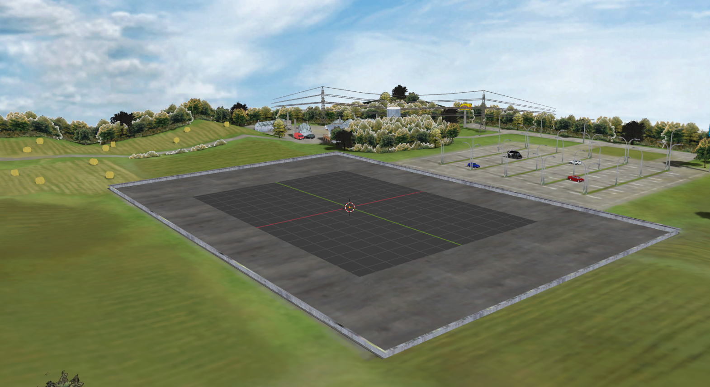

# Editing Stadium Editor assets

## Introduction
FIFA Manager games have 2 types of stadiums in 3D mode; default/custom stadiums and Stadium Editor stadiums.

## Default/custom stadiums

Default/custom stadiums have .o, .fsh, .loc and .bin files. Refer here for a detailed description.
https://github.com/muratcansarkalkan/fmspecific#file-convention-for-stadiums
We previously created tutorials for converting stadiums from other games, but they were in this format. In this article we will discuss editing Stadium Editor assets.
These stadiums will be referred as custom, while Stadium Editor stadiums will be referred as Editor from now on.

## Stadium Editor stadiums

All files related to stadiums can be found in data/stadium.

   
   
Content inside FIFA has custom stadiums for teams, represented with IDs. For instance, Arsenal’s ID is 000E0001, so in FIFA directory, there is a directory named 000E0001 and game loads the files. Usually the game loads custom stadium but when CPU teams/user team expands their stadium, it allows user to load either custom stadium, or Editor stadium in 3D Options section. The game also allows users to have Editor stadiums for teams. You can export Editor stadiums through Stadium Editor in-game. For example, if you created a replica for Franz-Horr-Stadion of Austria Wien in Stadium Editor and want to use it by default, you can save the file as 00040002 (ID of Austria Wien) in FIFA Manager/data/stadium.

   

If you want to load custom stadiums, you enable 2 options at the top. If not, Editor stadium will be in effect.

## Stadium Editor assets

Stadium Editor stadiums are technically very similar to custom stadiums. They use model and texture files. The difference is, there isn’t a compact model for these stadiums – files such as 000E0001 load a bunch of model pieces and textures to create a complete stadium. That file has location, rotation and scale data for stadium and environment models and information for what textures to be used.
The models and textures are inside the generator directory.

   

StadMain.big has all textures, while Stadelems.big has model files for all assets (tribunes, roof, flood lights, billboards, exterior assets such as buildings, trees).
In order to actually edit models we need to be delicate. A model file can be used my many stadiums. This limits our options. However with exterior we are more flexible.

## Contents of .big files

   

The contents of StadElems.big are straightforward. There are .o files in each of these directories. To export contents of these .o files, you can use OTools by Dmitri (link at README.md). Once you export .o to a .gltf, it will be directly available to import into Blender. 

   

We can't say the same for StadMain.big. You need to export all textures in .fsh files. OTools allows user to export from multiple .fsh files (choosing folder) and export them into sub-directories. To match the textures in Blender for the model you exported, you need to find the correct .fsh file in StadMain.big and match textures.

In the following example, I exported environments/bc_5_0557.o to .gltf. Then imported the .gltf file in Blender, scaled all objects by 0.01 to see the model easier, then rotated all objects by -90 degrees in X axis.

   

Then I looked through all textures that are supposed to be available in Blender and tried to find the texture file that has the same list of images. Turns out, for this model, it's rurald.fsh. I exported contents of rurald.fsh with OTools, then back to Blender, chose Find Missing Files and pointed the directory where I exported contents of rurald.fsh. This is a vague explanation, it can be updated in near future if there are people interested.

   
