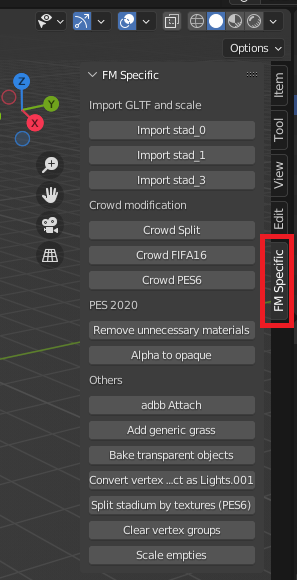

# FIFA Stadium Conversion Scripts

A collection of scripts for converting stadiums from FIFA16, PES6, and PES2020 to FIFA Manager 14 in Blender.

## Compatibility

These scripts are compatible with Blender 3.1.

## Installation

1. Download the repository as a ZIP file by clicking the "Code" button and selecting "Download ZIP."
2. Open Blender.
3. Go to `Edit` -> `Preferences`.
4. Click on the `Add-ons` tab.
5. Click the "Install" button at the top right.
6. Select the downloaded ZIP file and click "Install Add-on."
7. Enable the installed add-on by checking the checkbox next to its name.

## Required Tools and Prerequisites

Before using the PES6 to FIFA Manager conversion scripts, you need to set up the following tools:

1. **Blender 2.9+**:
   - Download and install Blender from [https://www.blender.org/download/](https://www.blender.org/download/).

2. **Adobe Photoshop**:
   - Download and install Adobe Photoshop. You can find the latest version at [https://www.adobe.com/uk/products/photoshop/free-trial-download.html](https://www.adobe.com/uk/products/photoshop/free-trial-download.html).
   - Alternatively, you can use the free CS2 version available on the internet.

3. **Latest OTools Version**:
   - Download the latest version of OTools from [https://bitbucket.org/fifam/otools/downloads/](https://bitbucket.org/fifam/otools/downloads/).

4. **PES6 to FIFA Manager Converter**:
   - Download the PES6 to FIFA Manager converter from [https://www.mediafire.com/file/wgbvkwnv8khedmb/pes6_to_fifam.7z/file](https://www.mediafire.com/file/wgbvkwnv8khedmb/pes6_to_fifam.7z/file).
   - Extract the contents to a convenient location.

5. **Additional file setup**:
   - Copy the `stadium_3.blend` and `shad.png` from the `sample` folder inside the repository.
   - Paste `shad.png` into the `pes6_to_fifam` directory.
   - Move `stadium_3.blend` into the `Extra\fm_season` directory within the `pes6_to_fifam` directory.

6. **Lighting Setup**:
   - Copy the `lights.blend` file and `2439-4.png` image from the `sample` folder inside the repository.
   - Paste them into the directory you specified as output path for pes6_to_fifam.

This is how the directory structure inside pes6_to_fifam should look:

```bash
├── pes6_to_fifam
│   ├── Extra
│   │   ├── fm_13
│   │   ├── fm_season
│   │   │   ├── stadium_3.blend
│   │   │   ├── ...
│   │   ├── shad.png
│   ├── pes6_to_fifam.bat
│   ├── pes6_to_fifam.exe
│   ├── README.txt (Please read this before doing anything)
```
Assuming you specified an output path as "D:\Convert" for pes6_to_fifam and imported a stadium named "ENG - Home Park", this is how the directory structure should look:

```bash
├── D:\
│   ├── Convert
│   │   ├── ENG - Home Park
│   │   │   ├── 0
│   │   │   │   ├── ...
│   │   │   │   ├── stadium_3.blend
│   │   │   ├── 1
│   │   │   │   ├── ...
│   │   │   │   ├── stadium_3.blend
│   │   │   ├── 3
│   │   │   │   ├── ...
│   │   │   │   ├── stadium_3.blend
│   │   ├── lights.blend
│   │   ├── 2439-4.png
```
## File structure for PES6 stadia

For a custom PES6 stadium, make sure that the directory has at least one of the 1_day_fine, 2_day_rain and 4_night_fine directories.

## Usage

After installing the FIFA Stadium Conversion Scripts add-on, you can access it within Blender:

1. Open stadium_3.blend.
2. Navigate to the 3D View.
3. Look for the "FM Specific" tab in the N-panel on the right side of the 3D View.

   

4. Within the "FM Specific" tab, you'll find various scripts categorized based on their functionality.

   - **Import GLTF and Scale**
      - Make sure you have the stadium GLTF files (`stadium_0.gltf`, `stadium_1.gltf`, `stadium_3.gltf`) available in the same blend file you've opened in Blender.
      - This function imports the gltf file, scales the stadium by 0.01 for easier editing, then moves whole stadium by 0.0125 meters to avoid flickering.
      - Import stad_0: Imports `stadium_0.gltf`
      - Import stad_1: Imports `stadium_1.gltf`
      - Import stad_3: Imports `stadium_3.gltf`

   - **Crowd Separation**
      - Crowd FIFA16: Separates crowds based on their texture for FIFA16 stadia.
      - Crowd PES6: Separates crowds based on their texture for PES6 stadia.

   - **Crowd Distribution**
      - Crowd Split: Equally and randomly distributes crowds for both away and home to 4 different materials (0,1,2,3)
      
   - **PES 2020**
      - Remove Unnecessary Materials: Removes every other material from the blend file unless the texture is a diffuse texture.
      - Alpha to Opaque: Switches blending type of Selected objects from alpha blend, to opaque.

   - **Others**
      - adbb Attach: Uses adbb
      - Add Generic Grass: `object.genericgrass`
      - Bake Transparent Objects: `object.baketrans`
      - Convert Vertex to Empties (Lights.001): `object.vertextolightglow`
      - Split Stadium by Textures (PES6): `object.texturesplit`
      - Clear Vertex Groups: `object.removevg`
      - Scale Empties: `object.scaleempties`

This tab provides easy access to the various functionalities offered by the FIFA Stadium Conversion Scripts.

## Warnings

- As the importing functions scale stadiums by 0.01, make sure you use "-scale 100" command at OTools while importing your output to an .o file.

## File convention for stadiums

There are 21 files that are related to a stadium. 

| Files      | Description |
| :---        |    :----   |
| collision_0.bin, collision_1.bin, collision_3.bin      | Collision is used to define how ball will interact with stadium geometry.       |
| complete.txt | This has no meaning. It is a placeholder file by me to periodically batch upload stadiums. |
| covmap_1.fsh   | Covmap file is used to define the shadows reflecting over the players        |
| effects_0.txt, effects_3.txt      | Effect files are used to determine the brightness and color of lights.       |
| lights_0.loc, lights_3.loc   | Determines light locations and rotations.        |
| shadow_0.o, shadow_1.o, shadow_3.o      | Shadow model used on the field. This needs to be separate from stadium model       |
| sky_0.o, sky_1.o, sky_3.o   | Sky model        |
| stadium_0.o, stadium_1.o, stadium_3.o      | Stadium model       |
| template.xml | This XML file manages preview settings for stadiums to be presented in menus. |
| texture_0.fsh, texture_1.fsh, texture_3.fsh   | Every texture used for the stadium is packed in this file including shadow and sky        |

The suffix of files which are 0, 1, 3 are representing the weather condition. FIFAM supports 3 different weather conditions in 3D mode; ***rainy*** (0), ***day*** (1) and ***night*** (3). Rainy and day weather is used in weekend games depending on the weather, while night state is used in weekday games whether it's raining/snowing or not. Collision, light, shadow, sky, stadium and texture files are separately built for each weather.

## Importing settings

Here are the settings you can use with descriptions.

| Command | Description |
| :---        |    :----   |
| -writefsh        |    Creates a .fsh file alongside the model.   |
| -stadium        |    Uses the stadium preset.   |
| -gentexnames        |    Generates texture names, if the texture names are larger than 4 characters.   |
| -fshLevels 5       |    Levels of [mipmaps](https://en.wikipedia.org/wiki/Mipmap).   |
| -srgb        |    Related to vertex colors. The vertex colors are displayed properly.   |
| -vColScale 0.5        |    Adjusts the brightness of vertex colors for the game.   |
| -fshFormat dxt        |    FSH format. DXT is preferred for stadiums for better compression and display.   |
| -sortByName        |    Sorting objects by their names. This is helpful especially for arranging the display of transparent objects.   |
| -fshForceAlphaCheck        |    This is for better alpha detecting. Many PNGs are saved with alpha channel even when there are no transparent pixels |
| -scale 100        |    Scales the stadium by 100 while importing as we downscaled it by 0.01 in Blender.   |

# FAQ

## Addressing Flickering in Field Objects

In some cases, there might be flickering in the field objects. To mitigate this issue, you can follow these steps:

### Steps to Avoid Flickering

1. **Identify Field Objects:**
   - Open your blend file containing the stadium model.

2. **Edit Field Object:**
   - Locate the field object that is experiencing flickering.

3. **Enter Edit Mode:**
   - Select the field object.
   - Press `Tab` to enter Edit Mode.

4. **Select All Faces:**
   - Press `A` to select all faces of the field object.

5. **Move Faces in Z-Axis:**
   - Press `G` to enter the Grab mode.
   - Press `Z` to restrict movement to the Z-axis.
   - Move the faces slightly up or down by pressing `0.0025` and hitting `Enter`.

6. **Exit Edit Mode:**
   - Press `Tab` to exit Edit Mode.

### Notes

- This adjustment (moving faces up or down by 0.0025 m in the Z-axis) is a workaround to address flickering issues in the field objects.
- Experiment with the exact value based on your specific scene to find the most suitable adjustment.
- Save your blend file after making these adjustments.

Making this slight modification in the Z-axis for the affected field objects can help reduce or eliminate flickering during rendering.

## There is an error displaying transparent parts. Fences look terrible. Why does that happen?

- This is related to the rendering order of FIFA engine. EA’s game engine causes an ugly bug with transparent parts, if the objects are not ordered accordingly: Make sure that the more a mesh is in the front, the more backwards it should be in the part order of the stadium file.
- For example, consider 4 parts; stand (opaque), seats (either opaque or transparent), fence (transparent) and net (transparent). From last to first; it should be net, then fence, then seats, then stands. PES6 models are not built according to this rule, so this is on your part. You can do this by naming the parts, then using `-sortByName` option while importing OTools. The name of net part will be last one, while stand part would be first (eg. Net part starts with Z, fence with Y, seats with X, stands with W). Rename the parts from Outliner, or press F2 while you are at Object Mode.

## The shadow looks terrible on the field. Why does that happen?

- The is related to the rendering order of FIFA once again. To avoid the weird view of shadow, you need to separate the part that needs to overlap the field and export to .gltf file as *shadow_\*.gltf*, then import with OTools. You can use the same settings with importing stadiums.

## Do you plan to create tutorials for stadiums made for other PES or FIFA games?

- They are complex compared to PES6's models, so for now, no.

## Technical Details

The scripts are written in Python and leverage Blender's Python API. They are designed to work seamlessly with Blender 3.1.

Feel free to explore the source code to understand the implementation details and make any necessary modifications to suit your needs.

## Contribution

If you'd like to contribute or report issues, feel free to open an issue or submit a pull request.

## License

This project is licensed under the [MIT License](LICENSE).
